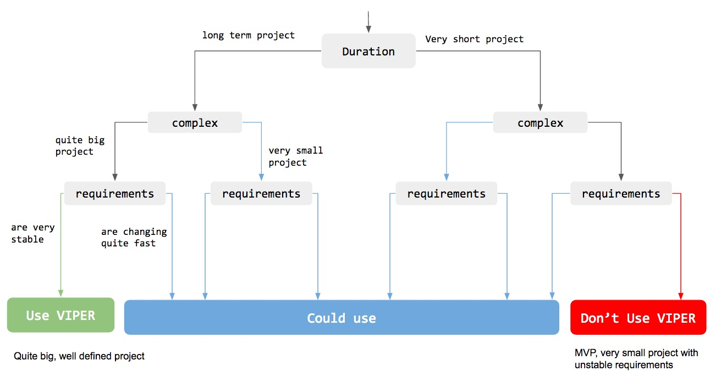
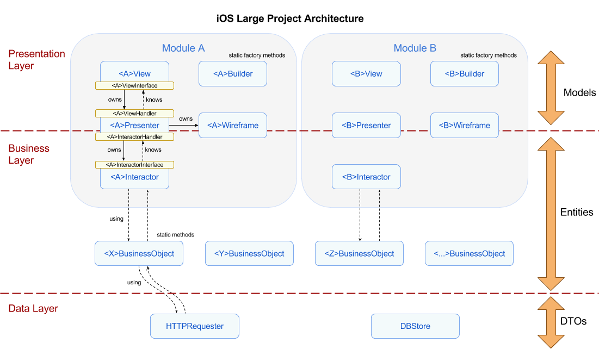
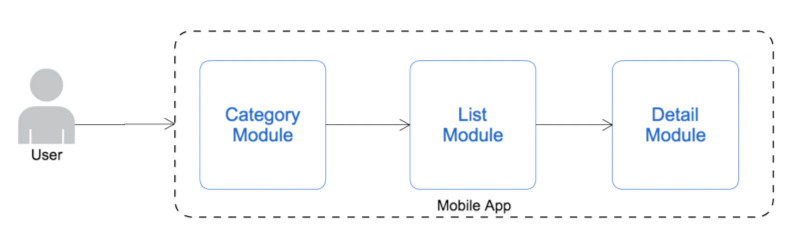
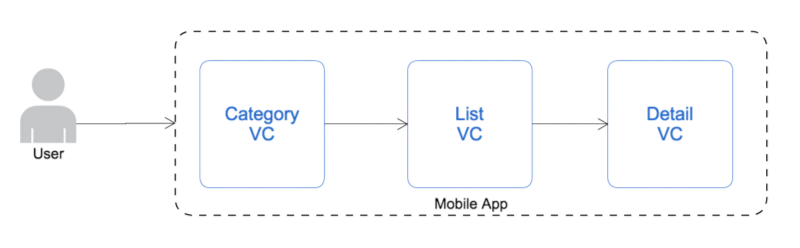
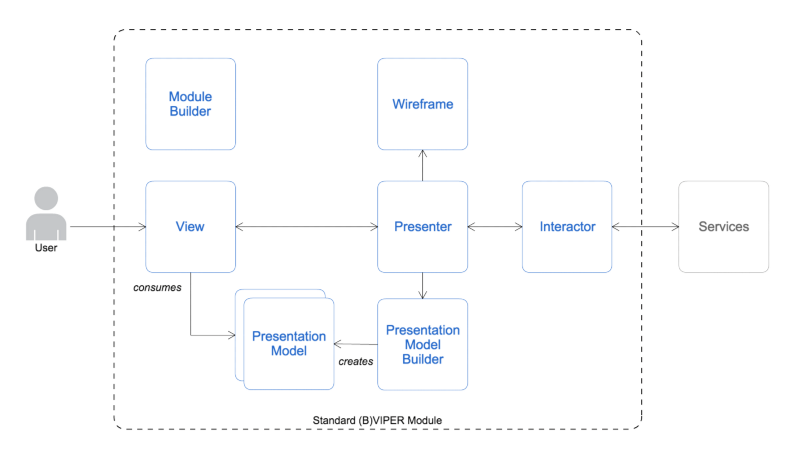

# iOS Large Project Architecture Definition

The following document describes the architecture defined by the Mobile Competence Center iOS Team to use in large projects. The document intends to describe each element of the architecture in a very simple way.

When developing an application it's very important to think about which are the available resources, how much time the team has in order to achieve the project's deadline, what's the general iOS architecture knowledge of the team, if it's a simple demo project or it's a long term app with many future updates... All these questions must be taken in account to decide which architecture apply.

There are many online resources discussing the use of one architecture amongst another one. The following link compares the main aspects of the *MVC, MVP, MVVM and VIPER*.

<https://medium.com/ios-os-x-development/ios-architecture-patterns-ecba4c38de52#.rxgetczcu>

It's important to note that each approach has its own advantages and caveats. Remember, choosing the proper architecture is always a very important step on any application development.

## Based on VIPER

After checking many architecture approaches on the net, the MCC decided to use a lighly modified version of VIPER architecture. This document doesn't fully describe the VIPER architecture so it's recommended to read about it on the net: 

* <https://www.ckl.io/blog/ios-project-architecture-using-viper/>
* <http://www.mttnow.com/blog/architecting-mobile-apps-with-bviper-modules>
* <https://swifting.io/blog/2016/03/07/8-viper-to-be-or-not-to-be/>
* <https://www.objc.io/issues/13-architecture/viper/>

The main reasons for choosing this architecture are:

* It covers the navigation responsibility (Routing). Other architecture approaches don't.
* It specifies the use of different entity layers (Entity).
* It follows the distribution of responsibilities in a very good way.
* It ensures very well the future scalability of large projects.
* Has a very good testability.
* Very easy to work with in teams, each team member can focus on each separated module avoiding future conflicts.

Of course, it also has some disadvantages:

* The need of writing a huge amount of interface for classes with very small responsibilities.
* The whole team needs to understand the architecture concepts very well.

VIPER has also some problems, majority of them come when digging into the implementation details. At first glance each architecture seems very well defined, but it's when the development starts the real problems appear. The following links contain some of these issues:

* <http://stackoverflow.com/questions/28995640/questions-about-viper-clean-architecture>
* <https://github.com/mutualmobile/VIPER-TODO/issues/4>

Choosing VIPER for a Project?



## iOS MCC Large Project Architecture overview

The following diagram shows an entire overview of the defined architecture for **Large iOS Projects**.

Three main aspects should be taken in account: 

1. existence of three different layers (left side).
2. different classes conforming each module and service provider classes (middle part).
3. different data objects used to transport data through different layers (right side).



---

###Layers

The defined architecture defines 3 different layers:

* **Presentation Layer**: the presentation layer is the responsible of presenting and updating all the UI to the user. It is also the responsible of managing the navigation, presenting and dismissing the different views when requested. Views, Presenters and Wireframes belong to this layer.
* **Business Layer (Domain Layer)**: the business logic layer, as it name states, holds all the business logic from the app. This layer will offer all the needed interfaces and methods to perform the different Use Cases defined. This layer is not aware of any UI part. Interactors and Business Objects belong to this layer. 
* **Data Layer**: the data layer holds all the services and resources that business logic layer may need in order to satisfy their use cases or business logic actions. As a consequence this data layer is very agnostic between projects. A data layer probably contains an HTTPRequester, a CoreDataStore, a RealmStore, a KeyChainStore classes... These services must be horizontal to Modules avoiding code duplication.

---

###Classes

###### Modules

VIPER relies on creating different modules to separate each screen or Use Case of the app (remember to check further VIPER documentation on the net). A fast description of each module according VIPER rules is: 

* **View**: encapsulates the actual views, starting from view controllers.
* **Interactor**: encapsulates all the business logic and datasource access.
* **Presenter**: encapsulates the presentation logic.
* **Routing (Wireframe)**: encapsulates the navigation logic.
* **Builder**: encapsulates the creation of its belonging entire module.

The **Builder** module part addition is based on this post [BVIPER architecture](http://www.mttnow.com/blog/architecting-mobile-apps-with-bviper-modules). The Builder decouples the module creation responsibility from the legacy Wireframe part.

There are some posts that suggest that each *Use Case* should be separated on one different module, but putting that in practice would lead to implement too many different modules in some cases. As iOS devs come from the MVC implicit native model, each **module** will be related to each different **View (ViewController)**, for example:

* LoginModule (related to a LoginViewController screen which contains one username/password form).
* PromotionsListModule (related to a PromotionsListViewController screen which holds a tableview of promotion cells).
* PromotionDetailModule (related to a PromotionDetailViewController screen which contains detailed info about a concrete promotion).
* ...

On the iOS platform navigation happens from UIViewController to UIViewController. It is foolish to fight against the framework, so a Module should be presenting itself to the outside world as a standard UIViewController.



Each module with its own **View, Presenter, Interactor, Wireframe** and **Builder** classes. Also, the different Protocols **ViewInterface**, **ViewHandler**, **InteractorInterface**, **InteractorHandler** (when using a Protocol Oriented Programming approach).



It's very important to understand that the **View** class holds all the module classes regarding **memory** **ownership**. So if the View is deallocated, then all the module is deallocated as well (The builder class is an static factory class, so it's not instanced anywhere). With this approach, a module can be represented entirely by its View class.

The use of Protocol oriented programming between View, Presenter and Interactor is optional. Of course, it's always better to decouple a concrete implementation from the interface, but omitting them in tight schedule projects could leverage the classes and protocols complexity.

###### Business Objects

In the diagram, some Business Object classes appear. VIPER focuses very well on decoupling responsibilities but it lacks a bit on reusability. Business Objects fill this lack of reusability providing some static methods to perform **common business actions**. They also avoid code duplication and improve the team productivity. 

A simple example would be, an application which requests a list of Promotions (GetPromotions WebService) from more than one screen. That would lead to request this information from more than one Interactor and each Interactor would have to configure the WebService call and the corresponding NSURLRequest. If we add a BusinessObject that provides an static method to perform this call, all this configuration stops being duplicated on each Interactor, and we reuse the same code. 

This approach should be used as much as possible trying to figure out which kind of Business Logic can be decoupled from the Interactors. Another clear example would be a BusinessObject which offers some methods to query information from the DB (is the authorization token expired?, is the user logged in?). This kind of queries tend to be used in more than one place.

In order to facilitate the use of these BusinessObjects, they should be simple **static classes** which offer a **set of static methods** (input > output, stateless). The main reason for this is to avoid having to inject the BusinessObjects during the creation of each module (that would lead to a more complex module creation scenario). If for any reason they need to store some kind of state info, the use of *in-memory CoreData or Realm stacks* approach could be used. Also *dependency injection frameworks like Typhoon* could be used.

###### Resource Provider Classes

The last type of classes is the **Resource Providers**. These classes belong to the **Data Layer** and they are responsible of retrieving the required Data from REST **APIs**, **DataBase** stacks or other sources. These classes are usually external dependencies.

Interactors and Business Objects use these classes to retrieve and send the data. Resource Provider classes must not know about the Business Logic of the app, neither services. They always **work** always with **DTO** objects, **not Domain Objects**. They should be ready to be used on other projects without any further modification, for example a generic HTTPRequester like the Alamofire framework (AFNetworking) pod.

---

### Data

VIPER also specifies different roles for the data holder classes. It defines that **Entities** must be used only in the Business Logic layer, not in the Presentation one. So at the very beginning VIPER applies a separation between the Business Logic Data and the UI/Presentation Data. This architecture adds a bit more, using three different data holder classes in order to decouple each layer properly.

* **View Model** objects are the ones used to keep an exact representation of the Presentation layer and UI. Storing the UI components values and also information about all the Views. In other architectures these objects have a big role, for example in the MVVM, where the binding between these objects and the UI View components ensures the View gets updated when the view model changes.
* **Entities** are the business logic model (also known as Domain Model) objects used to satisfy the different use cases of the app. Many VIPER sources specify that Entities must not be passed to the Presenter and they are only used by the Interactors (and Business Objects as well).
* **DTO** objects (also known as **VO** objects) are used to represent information from the resource providers (DB stores and API related services). They don't contain any Use Case related information, only plain data which then will be translated to Entities (Domain Model). 
 
Yet the restrictions are true regarding which class should use each type of data class, the architecture needs some bridging classes to translate from one data model to another. For example, to translate from Domain Model to Presentation Model.

In this case the architecture should follow the *Clean Architecture* approach which defines that **Entity** classes must be **mapped to View Model** classes in the **Presenter**. This conflicts directly with some statements of VIPER architecture like: "Entities are only manipulated by the Interactor. The Interactor never passes entities to the presentation layer (i.e. Presenter)". The defined architecture doesn't respect this statement, and leaves the translating process to the Presenter. It could be decoupled to a mapper class as well.

The following picture shows an example scenario where the Mapper is decoupled in a Presentation Model Builder class.



## Implementing the Architecture

An example would be a really simple app with a UINavigationController a Login screen and a master-detail scenario. The root view controller would be a UINavigationController subclass named RootNavigationController. The example tries to be very strict respecting the VIPER rules.


###The Login example module

**LoginBuilder factory class**

The LoginBuilder class only offers an static factory method which creates and links all the module parts. The builder class may be used by other Wireframe classes in order to create and then push or present new modules.

```
class LoginBuilder: NSObject {
    static func createLoginModule() -> LoginVC {
        let vc = LoginVC(nibName: "LoginVC", bundle: nil)
        let presenter = LoginPresenter()
        let interactor = LoginInteractor()
        let wireframe = LoginWireframe()
        
        vc.presenter = presenter
        presenter.view = vc
        presenter.interactor = interactor
        presenter.wireframe = wireframe
        interactor.presenter = presenter
        
        return vc
    }
}

```


**LoginWireframe class**

The LoginWireframe class offers the possible navigation transitions from the same Login Module. In this case pretty simple, from the login screen the only possible transition is pushing a new ItemList view (ItemList module).

```
class LoginWireframe {
    
    public func pushItemListModule(_ fromVC: UIViewController) {
        let vc = ItemListBuilder.createItemListModule()
        fromVC.navigationController?.pushViewController(vc, animated: true)
    }
}
```

The wireframe class is using the ItemListBuilder class to create the module. Using this approach the creation of the modules is very decoupled from the wireframes.

---

**LoginPresenter class**

The LoginPresenter holds the interactor and the wireframe instances. It has a weak reference to the view. In this case the view is represented by a class protocol. The LoginPresenter implements the LoginViewHandler and LoginInteractorHandler protocols.

```
class LoginPresenter: NSObject, LoginViewHandler, LoginInteractorHandler {
    weak var view : LoginViewInterface?
    var interactor : LoginInteractor?
    var wireframe : LoginWireframe?
    
    //MARK: LoginViewHandler callbacks
    
    func loginViewDidPressLoginButton(_ userName: String?, _ password: String?) {
        self.interactor?.requestLogin(userName, password)
    }
    
    func loginViewDidPressForgotPasswordButton() {
        //todo:
    }
    
    func loginViewDidPressRegisterButton() {
        //todo:
    }
    
    
    //MARK: LoginInteractorHandler callbacks
    
    func requestLoginDidFinish(_ loggedIn: Bool) {
        if loggedIn {
            self.wireframe?.pushItemListModule(self.view as! UIViewController)
        } else {
            //todo: show error feedback
        }
    }
    
}

```

The example only implements the Login Button pressed action. The presenter requests to the Interactor to perform a Login, so it doesn't know anything about how the Login process is executed. The example is not using entities neither view models classes (the username and password parameters are just plain String classes).

Once the Interactor has finished with the Login process, it will call the requestLoginDidFinish callback method, and the Presenter will use the wireframe to transition to a new module.

---

**LoginInteractor class** 

The interactor class is a very simple class which receives the requests from the Presenter class, and then after processing each request, it notifies the Presenter to update the UI or perform a new navigation transition. In the example an HTTP request is performed. 

The reference to the presenter is weak. 

```
protocol LoginInteractorHandler : class {
    func requestLoginDidFinish(_ loggedIn: Bool)
}

class LoginInteractor: NSObject {
    weak var presenter : LoginInteractorHandler?
    
    func requestLogin(_ userName: String?,_ password: String?) {
        
        // todo: 
        // perform an HTTP request to login using a Resource Provider class
        // once the HTTP response is received, notify the presenter
        
        let exampleURL = URL(string: "")
        let exampleRequest = URLRequest(url: exampleURL!)
        HTTPRequester.sendJSONRequest(exampleRequest,{(response: HTTPDataResponse<Any>) -> Void in
            if response.result.isSuccess {
				// notify the presenter
                self.presenter?.requestLoginDidFinish(loggedIn)
            } else {
                //todo: handle the request error
                self.presenter?.requestLoginDidFinish(false)
            }
        })
    }
}
```

---

**Login View class**

The LoginVC class is the view part of the Login module. It holds the presenter (in this case a class protocol LoginViewHandler). The user events are propagated to the presenter class which implements the protocol.

```

public protocol LoginViewHandler : class {
    func loginViewDidPressLoginButton(_ userName: String?, _ password: String?)
    func loginViewDidPressForgotPasswordButton()
    func loginViewDidPressRegisterButton()
}

class LoginVC: UIViewController {
    
    open var presenter: LoginViewHandler?

	..................
	More example stuff
	..................

 	@IBAction
    func buttonLoginPressed() {
        presenter?.loginViewDidPressLoginButton(textFieldUserName.text,textFieldPassword.text)
    }
    
    @IBAction
    func buttonForgotPasswordPressed() {
        presenter?.loginViewDidPressForgotPasswordButton()
    }
    
    @IBAction
    func buttonRegisterPressed() {
        presenter?.loginViewDidPressRegisterButton()
    }
}

```

---

###Other cases

#### App entry point

When starting the architecture implementation the first struggle is how to start the entry point of the app.

A possible entry point is to apply the VIPER rules to the Window's RootViewController. Using this, there is no need to do weird tricks and it follows all the rules. 

**RootNavigationController class**

In this case just a simple UINavigationController subclassing to allow the dependency with the presenter.

```
import UIKit

class RootNavigationController: UINavigationController {
    var presenter : RootNavigationControllerHandler?
}
```


**RootNavigationControllerBuilder factory class**

The builder factory method only creates the different module classes and links them together. 

```
import UIKit

class RootNavigationControllerBuilder {
    static func createRootNavigationControllerModule() -> RootNavigationController {
        let vc = RootNavigationController()        
        let presenter = RootNavigationControllerPresenter()
        let interactor = RootNavigationControllerInteractor()
        let wireframe = RootNavigationControllerWireframe(vc)
        
        vc.presenter = presenter
        presenter.view = vc
        presenter.interactor = interactor
        presenter.wireframe = wireframe
        interactor.presenter = presenter
        
        return vc
    }
}

```

**RootNavigationControllerWireframe class**

The wireframe offers the method to create the Login module and show it.

```

class RootNavigationControllerWireframe {
    
    weak private(set) var rootNavigationViewController : UINavigationController?
    
    init(_ rootNavigationController: UINavigationController) {
        self.rootNavigationViewController = rootNavigationController
    }
    
    public func showLoginView(_ animated: Bool = true) {
        let vc = LoginBuilder.createLoginModule()
        rootNavigationViewController?.setViewControllers([vc], animated: animated)
    }
}

```

**AppDelegate class**

The AppDelegate class only needs to create the RootNavigationControllerModule using the Builder class, and assign the returning View to the window rootViewController (this example is not using an storyboard approach).

```

@UIApplicationMain
class AppDelegate: UIResponder, UIApplicationDelegate {

    var window: UIWindow?

    func application(_ application: UIApplication, didFinishLaunchingWithOptions launchOptions: [UIApplicationLaunchOptionsKey: Any]?) -> Bool {
        let window = UIWindow(frame: UIScreen.main.bounds)
        self.window = window
        window.rootViewController = RootNavigationControllerBuilder.createRootNavigationControllerModule()
        window.makeKeyAndVisible()
        return true
    }
}

```

With the current memory ownserships described before, the root navigation controller (the majority of times a native UINavigationController) holds all the different modules, avoiding any complex ownerships which could lead to memory leaks in a future. 

#### Bridging between layers

VIPER layering allows for great decoupling, but the **way Modules should be built** and **communicate** is left to the designer.

It's important to understand that the **bridge between** the **Presentation Layer** and the **Business Layer** falls into the **Presenter class**. The Presenter receives the Entities from the Interactors (Domain Model) and translates them into View Models (Presentation Model).

* The View informs the Presenter on user interactions.
* The Presenter creates an immutable Presentation Model from Domain Model provided by the Interactor.
* The Presenter provides the View with the Presentation Model.

Also, **Data Layer** resource **provider** classes could be **reused** through **different** **projects**. For example, an HTTPRequester must not know about any specific webservice. It's only responsible of requesting resources to an API and returning the received response. The Business Layer as a Business Object or Interactor are the ones who configure each webservice call and send them through the HTTPRequester.


